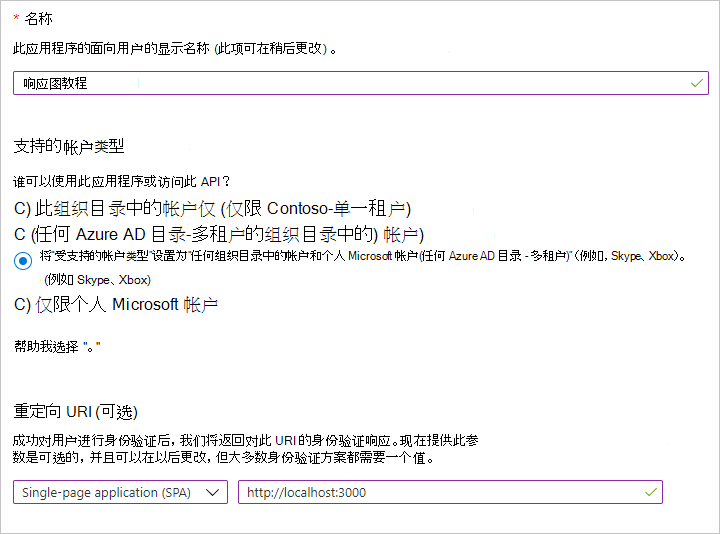

<!-- markdownlint-disable MD002 MD041 -->

在本练习中，你将使用 Azure Active Directory 管理中心创建新的 Azure AD web 应用程序注册。In this exercise, you will create a new Azure AD web application registration using the Azure Active Directory admin center.

1. 打开浏览器，并转到 [Azure Active Directory 管理中心](https://aad.portal.azure.com)。Open a browser and navigate to the [Azure Active Directory admin center](https://aad.portal.azure.com). 使用**个人帐户**（亦称为“Microsoft 帐户”）或**工作或学校帐户**登录。Login using a **personal account** (aka: Microsoft Account) or **Work or School Account**.

1. 选择左侧导航栏中的“**Azure Active Directory**”，再选择“**管理**”下的“**应用注册**”。Select **Azure Active Directory** in the left-hand navigation, then select **App registrations** under **Manage**.

    

    > [!NOTE]
    > Azure AD B2C 用户只能查看 \*\* (旧版) 的应用注册 \*\*。Azure AD B2C users may only see **App registrations (legacy)**. 在这种情况下，请直接转到 [https://aka.ms/appregistrations](https://aka.ms/appregistrations) 。In this case, please go directly to [https://aka.ms/appregistrations](https://aka.ms/appregistrations).

1. 选择“新注册”\*\*\*\*。Select **New registration**. 在“注册应用”\*\*\*\* 页上，按如下方式设置值。On the **Register an application** page, set the values as follows.

    - 将“名称”\*\*\*\* 设置为“`React Graph Tutorial`”。Set **Name** to `React Graph Tutorial`.
    - 将“受支持的帐户类型”\*\*\*\* 设置为“任何组织目录中的帐户和个人 Microsoft 帐户”\*\*\*\*。Set **Supported account types** to **Accounts in any organizational directory and personal Microsoft accounts**.
    - 在“重定向 URI”\*\*\*\* 下，将第一个下拉列表设置为“`Single-page application (SPA)`”，并将值设置为“`http://localhost:3000`”。Under **Redirect URI**, set the first drop-down to `Single-page application (SPA)` and set the value to `http://localhost:3000`.

    

1. 选择 **“注册”**。Choose **Register**. 在 " **响应图形教程** " 页上，将应用程序的值复制 \*\* (客户端) ID\*\* 并保存它，在下一步中将需要它。On the **React Graph Tutorial** page, copy the value of the **Application (client) ID** and save it, you will need it in the next step.

    
