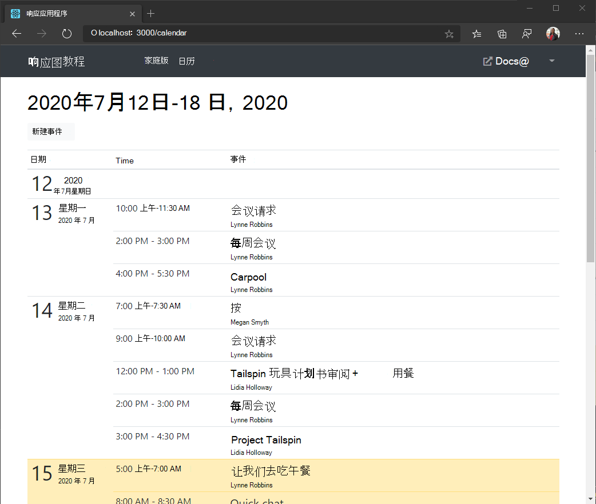

<!-- markdownlint-disable MD002 MD041 -->

在此练习中，你将将 Microsoft Graph合并到应用程序中。 对于此应用程序，你将使用[microsoft-graph-client](https://github.com/microsoftgraph/msgraph-sdk-javascript)库调用 Microsoft Graph。

## <a name="get-calendar-events-from-outlook"></a>从 Outlook 获取日历事件

1. 打开 `./src/GraphService.ts` 并添加以下函数。

    :::code language="typescript" source="../demo/graph-tutorial/src/GraphService.ts" id="getUserWeekCalendarSnippet":::

    考虑此代码将执行什么工作。

    - 将调用的 URL 为 `/me/calendarview`。
    - 方法将 标头添加到请求中，导致响应中的时间在 `header` `Prefer: outlook.timezone=""` 用户的首选时区。
    - `query`方法添加 `startDateTime` 和 `endDateTime` 参数，定义日历视图的时间窗口。
    - `select`方法将每个事件返回的字段限定为视图将实际使用的字段。
    - 方法按创建结果的日期和时间对结果进行排序，最新项 `orderby` 首先排序。
    - `top`方法将单个页面中的结果限制为 25 个事件。
    - 如果响应包含一个值，该值指示可用的结果更多，则使用对象在集合中分页获取 `@odata.nextLink` `PageIterator` 所有结果。 [](https://docs.microsoft.com/graph/sdks/paging?tabs=typeScript)

1. 创建React组件以显示调用的结果。 在目录中新建一个名为 `./src` 的文件 `Calendar.tsx` 并添加以下代码。

    ```typescript
    import React from 'react';
    import { NavLink as RouterNavLink } from 'react-router-dom';
    import { Table } from 'reactstrap';
    import moment, { Moment } from 'moment-timezone';
    import { findIana } from "windows-iana";
    import { Event } from 'microsoft-graph';
    import { config } from './Config';
    import { getUserWeekCalendar } from './GraphService';
    import withAuthProvider, { AuthComponentProps } from './AuthProvider';

    interface CalendarState {
      eventsLoaded: boolean;
      events: Event[];
      startOfWeek: Moment | undefined;
    }

    class Calendar extends React.Component<AuthComponentProps, CalendarState> {
      constructor(props: any) {
        super(props);

        this.state = {
          eventsLoaded: false,
          events: [],
          startOfWeek: undefined
        };
      }

      async componentDidUpdate() {
        if (this.props.user && !this.state.eventsLoaded)
        {
          try {
            // Get the user's access token
            var accessToken = await this.props.getAccessToken(config.scopes);

            // Convert user's Windows time zone ("Pacific Standard Time")
            // to IANA format ("America/Los_Angeles")
            // Moment needs IANA format
            var ianaTimeZones = findIana(this.props.user.timeZone);

            // Get midnight on the start of the current week in the user's timezone,
            // but in UTC. For example, for Pacific Standard Time, the time value would be
            // 07:00:00Z
            var startOfWeek = moment.tz(ianaTimeZones![0].valueOf()).startOf('week').utc();

            // Get the user's events
            var events = await getUserWeekCalendar(accessToken, this.props.user.timeZone, startOfWeek);

            // Update the array of events in state
            this.setState({
              eventsLoaded: true,
              events: events,
              startOfWeek: startOfWeek
            });
          }
          catch (err) {
            this.props.setError('ERROR', JSON.stringify(err));
          }
        }
      }

      render() {
        return (
          <pre><code>{JSON.stringify(this.state.events, null, 2)}</code></pre>
        );
      }
    }

    export default withAuthProvider(Calendar);
    ```

    现在，这只是在页面上以 JSON 呈现事件数组。

1. 将此新组件添加到应用。 打开 `./src/App.tsx` 并添加 `import` 以下语句到文件顶部。

    ```typescript
    import Calendar from './Calendar';
    ```

1. 将以下组件添加到现有 组件之后 `<Route>` 。

    ```typescript
    <Route exact path="/calendar"
      render={(props) =>
        this.props.isAuthenticated ?
          <Calendar {...props} /> :
          <Redirect to="/" />
      } />
    ```

1. 保存更改并重新启动该应用。 登录并单击导航 **栏中** 的"日历"链接。 如果一切正常，应在用户日历上看到事件被 JSON 卸载。

## <a name="display-the-results"></a>显示结果

现在，你可以 `Calendar` 更新组件以更用户友好的方式显示事件。

1. 在目录中新建一个名为 `./src` 的文件 `Calendar.css` 并添加以下代码。

    :::code language="css" source="../demo/graph-tutorial/src/Calendar.css":::

1. 创建一React组件，将一天中的事件呈现为表格行。 在目录中新建一个名为 `./src` 的文件 `CalendarDayRow.tsx` 并添加以下代码。

    :::code language="typescript" source="../demo/graph-tutorial/src/CalendarDayRow.tsx" id="CalendarDayRowSnippet":::

1. 将以下 `import` 语句添加到 **Calendar.tsx 的顶部**。

    ```typescript
    import CalendarDayRow from './CalendarDayRow';
    import './Calendar.css';
    ```

1. 将 中的 `render` 现有函数 `./src/Calendar.tsx` 替换为以下函数。

    :::code language="typescript" source="../demo/graph-tutorial/src/Calendar.tsx" id="renderSnippet":::

    这会将事件拆分为其各自的天数，并呈现每天的表格部分。

1. 保存更改并重新启动应用。 单击" **日历"** 链接，应用现在应呈现一个事件表。

    
